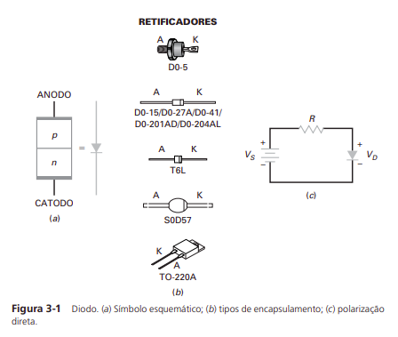
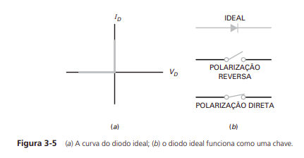
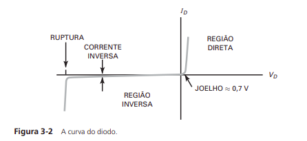
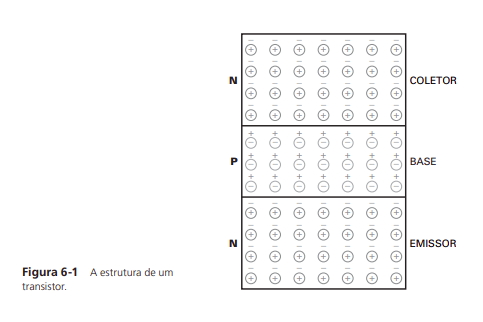
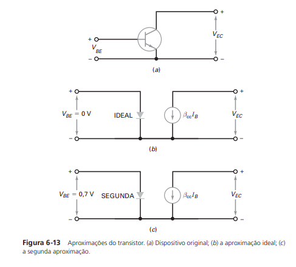

# Revisão de análise de circuitos elétricos e eletrônicos

## Tensão e corrente

A **tensão elétrica** é um valor que corresponde à diferença de potencial entre dois pontos de um circuito ou entre um ponto e um referencial (geralmente rotulado como **ground** ou simplesmente **GND**). Já a **corrente elétrica** é um valor que corresponde ao fluxo instantâneo de carga em um condutor (não confunda com fluxo de elétrons). É possível pensar em corrente elétrica como uma grandeza semelhante à vazão da hidrodinâmica, que mede a quantidade de fluido que passa por um condutor em uma fração ínfima de tempo.&#x20;

Uma observação importante de se fazer é que, uma vez que a carga que passa pelo condutor elétrico é transportada por elétrons, que têm carga elementar negativa ($$-1,602 176 634 \times 10^{−19}$$ _Coulombs_), o sentido do fluxo dos elétrons tende a ser oposto ao sentido do fluxo da carga (ou seja, oposto ao sentido da corrente). **Portanto, não confunda, corrente elétrica e fluxo de elétrons não são a mesma coisa.**

## Fontes

### Fonte DC

Fontes DC são dispositivos elétricos que geram uma diferença de potencial (DDP) constante em seus terminais. Idealmente, fontes DC possuem resistência interna nula e capacidade ilimitada de conduzir corrente. Na prática, essas fontes possuem resistências internas muito pequenas e correntes limitadas.&#x20;

Parâmetros de uma fonte DC:

* **Tensão em **_**Volts**_** (V)** - diferença de potencial (DDP) que a fonte produz em seus terminais.
* **Potência máxima em **_**Watts**_** (W)** - valor proporcional à tensão da fonte e à sua corrente máxima, calculado como $$P=UI_{\text{max}}$$ (onde $$P$$ é a potência máxima em _Watts_, $$U$$é a tensão em _Volts e_ $$I_\text{max}$$é corrente máxima em Amperes).

### Fontes de tensão AC

Tal como as fontes DC, as fontes AC são dispositivos responsáveis por gerar uma diferença de potencial entre seus terminais. No entanto, nas fontes AC esta diferença de potencial varia com o tempo, seguindo, geralmente, um padrão de onda senoidal. Os parâmetros de uma fonte AC real são os seguintes:

* **Amplitude de sinal em **_**Volts**_** (V)** _-_ valor correspondente à amplitude da diferença de potencial senoidal.
* **Frequência de sinal em **_**Hertz**_** (Hz)** - valor correspondente à frequência da senoide gerada.
* **Potência aparente máxima em Volt-Ampere (VA)** - é um valor relacionado à corrente máxima que a fonte pode conduzir.

Considerando que uma fonte AC tem amplitude $$a$$ e frequência $$f$$, sua tensão variante no tempo $$u(t)$$ será:

$$
u(t) = a\sin(2\pi f t)
$$

Para casos nos quais há mais de uma fonte AC no circuito, também é importante considerar um outro parâmetro: a diferença de fase. A diferença de fase é, basicamente, um "atraso" de uma senoide em relação a outra. Considerando duas fontes AC de tensão $$u_1(t)$$ e $$u_2(t)$$ e com uma diferença de fase $$\phi$$, essas tensões podem ser definidas como:

$$
u_1(t) = a_1\sin(2\pi ft)
$$

$$
u_2(t) = a_2\sin(2\pi ft + \phi)
$$

## Componentes lineares

Componentes lineares são aqueles cuja tensão terminal (DDP entre os terminais) e a corrente se relacionam através de coeficientes constantes e operadores diferenciais, que são lineares. São eles os resistores, os capacitores e os indutores.

### Resistor

O resistor é o mais simples dos componentes elétricos. Sua função é controlar a corrente em um condutor ou converter energia elétrica em energia térmica.&#x20;

O principal parâmetro do resistor é sua resistência, medida em Ohms ($$\Omega$$). A corrente $$I$$ através do resistor se relaciona à sua tensão terminal $$U$$e à sua resistência $$R$$ da seguinte forma:

$$
U=RI
$$

Esta equação é conhecida como **Lei de Ohm**. Nesta equação, a tensão $$U$$ pode corresponder tanto a uma fonte de tensão conectada diretamente aos terminais do resistor como a uma queda de tensão produzida pelo resistor em uma malha.

### Capacitor

Capacitores são componentes compostos por pares de placas condutoras paralelas separadas por um material dielétrico. Estes componentes são responsáveis por armazenar carga em suas placas condutoras, funcionando como "baterias rápidas".

O capacitor começa a ser carregado quando é conectado à uma fonte de tensão. O campo elétrico entre as placas condutoras fazem com que haja, inicialmente, um fluxo de carga (ou seja, uma corrente) "saindo" do terminal positivo da fonte e indo em direção ao terminal negativo da fonte. Esta carga, no entanto, encontra a "barreira" do dielétrico no meio do caminho, e acaba se acumulando nas placas. O acumulo de carga nas placas faz com que o capacitor se comporte como uma bateria, produzindo uma tensão terminal que se cancela com a tensão da fonte. Essa tensão terminal cresce gradualmente até se igualar à tensão da fonte, e neste ponto a corrente cessa. Este período em que há corrente no capacitor depende do circuito no qual o mesmo está inserido. Há casos em que este período tende a zero, mas também há casos em que este período é consideravelmente longo e casos em que esta corrente aparece e desaparece periodicamente.

O principal parâmetro do capacitor é sua **capacitância**, medida em _Farads_ (F). A capacitância é, basicamente, uma medida de capacidade de armazenar energia em forma de campo elétrico.&#x20;

No capacitor, a tensão terminal _Uc_, a corrente _I,_ a capacitância _C_ e o tempo _t_ se relacionam de acordo com a seguinte equação diferencial:

$$
I = C\frac{dU_C}{dt}
$$

Repare que, pelas regras básicas de derivação, a corrente _I_ é nula quando _U_ é constante. Este é o caso em que o capacitor funciona como uma chave aberta no circuito, podendo inclusive ser desprezado. Mas isto muda quando há uma resistência em série com o resistor ou quando há variações de tensão ao longo do tempo.&#x20;

Como já foi dito, o capacitor acumula carga em suas placas. Esta carga de _Q_ C_oulombs_ é definida em relação à corrente _I_ pela seguinte equação:

$$
Q = \int I dt
$$

Já a tensão terminal $$U_c$$ do capacitor é definida em relação à carga _Q_ e à capacitância _C_ da seguinte forma:

$$
U_c=\frac{Q}{C}
$$

Quando o capacitor é conectado a uma fonte de tensão AC, ele tende a se comportar como um "resistor especial", pois ao invés de bloquear a passagem de corrente, ele a controla. Podemos demonstrar isso usando a transformada de Laplace e a equação $$U_c=Q/C$$.

$$
\mathcal{L}\{U_c(t)\} = \mathcal{L}\left\{\frac{1}{C}Q(t)\right\} = \mathcal{L}\left\{\frac{1}{C}\int I(t) dt \right\}
$$

Usando as seguintes propriedades da transformada de Laplace:

* &#x20;$$\mathcal{L}\{F(t)\} = {f}(s)$$, onde _F(t)_ é uma função no domínio do tempo e _f(s)_ é a mesma função no domínio das frequências;
* &#x20;$$\mathcal{L}\{aF(t)\} = a\mathcal{L}\{F(t)\}$$, onde $$a$$ é um coeficiente constante;
* &#x20;__ $$\mathcal{L}\left\{\int F(t)dt\right\} = \frac{f(s)}{s}$$__

chegamos à seguinte equação:

$$
u_c(s) = \frac{1}{sC}i(s)
$$

Repare que esta equação tem exatamente o mesmo formato que a lei de Ohm (_U=RI_) se considerarmos que _R=1/sC_. Este _R=1/sC_ é a "resistência especial" que o capacitor tem com corrente alternada. Esta "resistência" varia com a frequência da corrente AC e é chamada de **reatância capacitiva**. Ao invés de _R_,  costuma-se usar o símbolo $$X_C$$ para indicar a reatância capacitiva.

$$
X_C = \frac{1}{sC}
$$

Mais importante do que decorar todas estas equações diferenciais é lembrar do papel que os capacitores exercem em boa parte de suas aplicações: **opor-se à variação de tensão.** Esta oposição às variações de tensão que os capacitores apresentam é recorrentemente utilizada para atenuar ruídos e frequências indesejáveis em circuitos eletrônicos.&#x20;

### Indutor

Os indutores são primos dos capacitores. Um indutor consiste, de forma simplificada, em um condutor enrolado em torno de um núcleo, que pode ser de ar ou de algum material sólido. Estes componentes armazenam energia em forma de campo magnético (enquanto os capacitores armazenam em forma de campo elétrico).

O principal parâmetro do indutor é sua **indutância**, medida em _Henrys_.

A relação tensão-corrente dos indutores é descrita pela seguinte equação diferencial:

$$
U_L = L \frac{dI}{dt}
$$

Onde $$U_{L}$$é a tensão terminal do indutor, $$L$$ é a indutância, $$I$$ é a corrente que passa pelo indutor e $$t$$ é o tempo.

Pelas regras básicas de derivação, não há tensão terminal $$U_L$$ quando a corrente _I_ é constante. A ausência de tensão terminal indica a livre circulação de corrente através do componente, o que é um comportamento de chave fechada ou curto-circuito. No entanto, quando há variação de corrente, também há variação na tensão $$U_L$$.

Assim como o capacitor, quando submetido a correntes alternadas, o indutor também se comporta como um "resistor especial" cuja resistência depende da frequência. Sua "resistência especial" é denominada **reatância indutiva**, e é definida no domínio das frequências da seguinte forma:

$$
X_L = sL
$$

### Impedância

Impedância é um termo muito usado no âmbito da elétrica que significa, basicamente, **soma de resistências e reatâncias.** A impedância de um circuito formado por um resistor, um capacitor e um indutor, todos em série, pode ser descrita no **domínio das frequências** da seguinte forma:

$$
Z = R + \frac{1}{sC} + sL
$$

## Associações de componentes lineares

Múltiplos componentes lineares de mesmo tipo combinados em série ou paralelo tendem a comportar-se como um único componente.

### Resistores em série

Uma sequência$$[R_1,R_2,...,R_n]$$ de resistências em série pode ser simplificada como uma única resistência $$R_{eq}$$ tal que:

$$
R_{eq} = R_1 + R_2 + ... + R_n = \sum_{i=1}^n R_i
$$

### Resistores em paralelo

Uma sequência $$[R_1,R_2,...,R_n]$$ de resistências em paralelo pode ser simplificada como uma única resistência $$R_{eq}$$ tal que:

$$
R_{eq} = \left( \frac{1}{R_1} + \frac{1}{R_2} + ... + \frac{1}{R_n} \right)^{-1} = \left( \sum_{i=1}^n \frac{1}{R_i} \right)^{-1}
$$

### Capacitores em série

Uma sequência $$[C_1, C_2, ..., C_n]$$ de capacitâncias em série equivale a uma única capacitância $$C_{eq}$$ tal que:

$$
C_{eq} = \left( \frac{1}{C_1} + \frac{1}{C_2} + ... + \frac{1}{C_n}\right)^{-1} = \left( \sum_{i=1}^n \frac{1}{C_i} \right)^{-1}
$$

### Capacitores em paralelo

Uma sequência $$[C_1, C_2, ..., C_n]$$ de capacitâncias em paralelo equivale a uma única capacitância $$C_{eq}$$ tal que:

$$
C_{eq} = C_1 + C_2 + ... + C_n =\sum_{i=1}^n  C_i
$$

### Indutores em série e paralelo

As regras de associação de indutores são similares às regras de associação de resistores. Uma sequência de indutâncias em série equivale a uma única indutância $$L_{eq} = L_1 + L_2 + ... L_n$$, e uma sequência de indutâncias em paralelo equivale a uma única indutância $$L_{eq} = \left( \frac{1}{L_1} + \frac{1}{L_2} + ... + \frac{1}{L_n}\right)^{-1}$$.

## Leis de Kirshhoff

As leis de Kirshhoff são muito úteis para encontrar incógnitas em circuitos, como tensões e correntes desconhecidas.&#x20;

### Lei das tensões

Pela lei de Kirshhoff das tensões, a soma das tensões terminais dos componentes de uma malha deve ser igual a zero.

Uma malha é, a grosso modo, um agrupamento de componente ligados em _loop._ Em uma malha onde há $$n$$ componentes, cada um com uma tensão terminal $$U_i$$, a soma de todas as tensões $$U_i$$ deve ser zero.

$$
U_1 + U_2 + ... + U_n = 0
$$

Considere, como exemplo, o seguinte circuito:

Este circuito é composto por uma malha de 3 componentes: uma fonte de $$U_s$$ Volts, um resistor de _R_ Ohms e um indutor de _L_ Henrys. As tensões terminais desses componentes são:

* Fonte: $$U_s$$&#x20;
* Resistor: $$U_r =RI$$
* Indutor: $$U_l = L \frac{dI}{dt}$$

Com base nisto, chegamos à seguinte equação:

$$
U_s - RI - L\frac{dI}{dt} = 0
$$

Repare que, nesta equação, as tensões $$U_r$$ e $$U_l$$ estão com o sinal invertido. Isto se deve ao fato de que o resistor e o indutor são componentes passivos, enquanto a fonte é um componente ativo.

A equação diferencial acima pode ser resolvida para encontrar a função $$I(t)$$. Com esta função, é possível calcular todas as tensões terminais da malha.

Também podemos fazer esta equação no domínio das frequências usando a transformada de Laplace. Neste caso, podemos tratar o indutor como um "resistor especial" e definir a tensão $$U_l$$ usando a lei de Ohm e a reatância indutiva $$X_L = sL$$.

$$
\mathcal{L}\{U_s(t)\} - R\mathcal{L}\{I(t)\} - sL\mathcal{L}\{I(t)\}  = 0
$$

$$
u_s(s) - Ri(s) - sLi(s)  = 0
$$

$$
i(s)= \frac{u_s(s)}{R + sL}
$$

A partir daí, você terá que usar uma tabela de transformadas de Laplace para encontrar a solução $$I(t)$$ desta equação, embora muita vezes nem seja tão interessante passar a solução para o domínio do tempo.

### Lei das correntes

A lei das correntes de Kirshhoff diz que a soma de todas as correntes que "entram" e "saem" de um nó do circuito deve ser zero.&#x20;

Considere o seguinte diagrama como exemplo:

O diagrama acima mostra um pedaço de circuito composto por um nó e 3 correntes. Repare que, olhando da esquerda para a direita, a corrente $$I_1$$ está "entrando" no nó e as correntes $$I_2$$ e $$I_3$$ estão "saindo" do nó. Nesta caso, aplicamos a lei de Kirshhoff das correntes da seguinte forma:

$$
I_1-I_2-I_3=0
$$

Repare que todas as correntes que "saem" do nó entram na equação com o sinal invertido.

Em casos em que as correntes do circuito são conhecidas, esta lei pode ser utilizada ao invés da lei das tensões.&#x20;

## Componentes eletrônicos

Eletrônica é a área da elétrica que trata de componentes como diodos, transistores e as antigas válvulas termiônicas. A maior parte dos circuitos eletrônicos modernos é baseada em de componentes eletrônicos feitos de materiais semicondutores como silício e germânio. Estes semicondutores passam por processos de dopagem, tornando-se tipo N ou tipo P. As próximas seções mostram que diodos e BJTs são feitos de junções PN e NP. &#x20;

### Diodos

Diodos são componentes de dois terminais feitos de junções de semicondutores. O uso mais básico desses componentes é o de "chave controlada" - basicamente, utiliza-se um diodo como uma chave que só permite a passagem de corrente em um sentido.

Diodos possuem dois polos: um anodo e um catodo. Idealmente, o diodo só permite a passagem de corrente do anodo para o catodo, que ocorre quando ele está diretamente polarizado. Na polarização inversa, que ocorre quando as tensões do circuito condicionam a corrente a circular do catodo ao anodo, a passagem de corrente é bloqueada e o diodo se comporta como uma chave aberta.

<figure><figcaption>
Figura retirada de (MALVINO, 2000)
</figcaption></figure>

<figure><figcaption>
Figura retirada de (MALVINO, 2000)
</figcaption></figure>

Na prática, este raciocínio precisa das seguintes ressalvas:

* Quando está diretamente polarizado, o diodo real só começa a permitir a passagem de corrente com resistência desprezível após a superação de um limite mínimo de tensão chamado de "tensão de joelho", normalmente de 0.7V
* Quando está inversamente polarizado, o diodo real começa a permitir a passagem de corrente com resistência desprezível após a superação de um limite mínimo de tensão inversa chamado de "tensão de ruptura".&#x20;
* A ideia de "chave controlada" é apenas uma aproximação.&#x20;

<figure><figcaption>
Figura retirada de (MALVINO, 2000)
</figcaption></figure>

Diodos podem ser utilizados para:

* [Converter corrente alternada em corrente contínua](https://pt.wikipedia.org/wiki/Retificador)
* [Criar limites de tensão entre dois condutores](https://en.wikipedia.org/wiki/Clipper\_\(electronics\))
* [Aumentar tensão](https://pt.frwiki.wiki/wiki/Doubleur\_de\_tension)
* Evitar curto-circuitos ao combinar fontes de tensão CC em paralelo
* [Emitir luz](https://pt.wikipedia.org/wiki/Diodo\_emissor\_de\_luz)

### Transistores bipolares de junção (BJTs)

Transistores bipolares de junção (BJTs) também são feitos de junções de semicondutores e também podem ser utilizados como chaves controladas.&#x20;

BJTs possuem três terminais: um coletor, uma base e um emissor. Estes terminais podem ser polarizados como NPN ou PNP.&#x20;

<figure><figcaption>
Figura retirada de (MALVINO, 2000)
</figcaption></figure>

Idealmente, um transistor NPN comporta-se como um fonte de corrente entre o coletor e o emissor controlada pela corrente que flui através da base, podendo ser utilizado como _buffer_, amplificador de sinal ou chave controlada.

<figure><figcaption>
Figura retirada de (MALVINO, 2000)
</figcaption></figure>

### Transistores de efeito de campo (FETs)

<mark style="color:red;">Para escrever...</mark>

## Bibliografia / Leitura recomendada

* BOYLESTAD, R. L. **Introdução à análise de circuitos**. São Paulo: Pearson Education Do Brasil, 2004.
* MALVINO, A.; BATES, D. J. **Eletrônica. Volume 1 (7a. ed.)**. \[s.l.] Grupo A - AMGH, 2000.
* PERTENCE JUNIOR, A. **Amplificadores operacionais e filtros ativos : teoria, projetos, aplicacoes e laboratorio**. Porto Alegre (RS): ARTMED, 2003.
