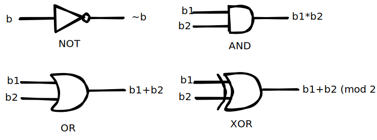

# Revisão de lógica digital

Circuitos digitais são circuitos que trabalham com lógica de dois níveis, que podem ser dois níveis de tensão, dois níveis de corrente, dois níveis de carga, etc. Para fins de simplificação, os níveis binários são abstraídos como _bits_ (termos binários), e os circuitos digitais são representados como cadeias de operações com _bits._

## Operações com _bits_

Um _bit_ $$b$$ é uma variável que pertence a um conjunto booleano $$\mathbb{B}=\{0,1\}$$. Os _bits_ são processados por funções $$\mathbb{B}^n \mapsto \mathbb{B}^m$$ que chamamos de portas lógicas. As principais portas lógicas são _NOT_, _AND_, _OR_ e _XOR_.

* _NOT_: $$b \mapsto \begin{cases}0, \quad b=1\\1, \quad b=0\end{cases}$$ ou, em álgebra booleana, simplesmente $$b \mapsto \overline{b}$$.
* _AND_: $$(b_1, b_2) \mapsto b_1b_2$$
* _OR_: $$(b_1, b_2) \mapsto b_1 + b_2 -b_1 b_2$$ ou, em álgebra booleana, simplesmente$$(b_1, b_2) \mapsto b_1 + b_2$$.
* _XOR_: $$(b_1, b_2) \mapsto b_1 \oplus b_2$$

Os comportamentos das portas lógicas podem ser interpretados das seguintes formas:

* _NOT_ - A saída é o _bit_ de entrada invertido.
* _AND_ - A saída só é 1 quando todas as entradas são 1.
* _OR_ - A saída é 1 quando pelo menos uma entrada é 1.
* _XOR_ - A saída é 0 quando os dois _bits_ de entrada são iguais. &#x20;

### Tabela verdade

Tabela verdade é um quadro contendo todas as entradas e saídas de uma cadeia de operações com _bits_. A tabela verdade da operação _NOT_, por exemplo, é a seguinte:

| b | NOT b |
| - | ----- |
| 0 | 1     |
| 1 | 0     |

Já a tabela verdade das operações _AND_, _OR_ e _XOR_, é a seguinte:

| b1 | b2 | b1 OR b2 | b1 AND b2 | b1 XOR b2 |
| -- | -- | -------- | --------- | --------- |
| 0  | 0  | 0        | 0         | 0         |
| 0  | 1  | 1        | 0         | 1         |
| 1  | 0  | 1        | 0         | 1         |
| 1  | 1  | 1        | 1         | 0         |

### Diagramas

Em diagramas de circuitos digitais, cada porta lógica é representada por um símbolo. Os símbolos das portas _NOT_, _AND_, _OR_ e _XOR_ são os seguintes:

## Sistema numérico binário

Em contraste com o sistema decimal, que é o sistema numérico que estamos habituados a usar e que representa números como sequências de dígitos de 0 a 9, o sistema binário é o principal sistema numérico dos dispositivos digitais. No sistema binário, os números são representados por sequências de _bits_, os quais têm a vantagem de serem fáceis de processar usando componentes digitais.

Considere um número natural $$\boldsymbol{x} \in \mathbb{N}$$. No sistema binário, este número é representado por uma sequência de _bits_ $$[x_n,...,x_2,x_1]$$ tal que:

$$
\boldsymbol{x} = \sum_{i=1}^n x_i 2^{i-1}
$$

No caso de, por exemplo, um _byte_, que é uma sequência de 8 _bits_, o valor natural do _byte_ é definido como $$x_1+2x_2+4x_3+8x_4+16x_5+32x_6+64x_7+128x_8$$.

### Notação de complemento de 2

Para representar números inteiros no sistema binário, emprega-se a **notação de complemento de 2**, que define o valor $$\boldsymbol{x} \in \mathbb{Z}$$ da seguinte forma:

$$
\boldsymbol{x} = \begin{cases}
    \sum_{i=1}^{n} 2^{i-1} x_i, \quad x_{n} = 0 \\
-(1 + \sum_{i=1}^{n} 2^{i-1} \overline{x_i}), \quad x_{n} = 1
\end{cases}
$$

Repare que, na notação de complemento de 2, o _bit_ mais significativo $$x_n$$determina se o número é positivo ou negativo. Esta é uma noção importante, pois o _bit_ de sinal, que determina se $$\boldsymbol{x} \geq 0$$ ou $$\boldsymbol{x} < 0$$, é determinante na implementação de operações relacionais (como $$>, <, \neq$$ e $$=$$) através de lógica digital.&#x20;

## Leitura recomendada

* Artigo: [Entendendo os circuitos dos flip-flops](https://medium.com/@filipe.chagas/entendendo-os-circuitos-dos-flip-flops-6c6ee1d6bf47)

