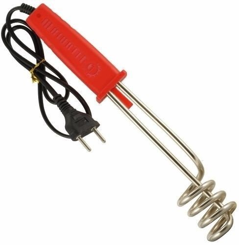
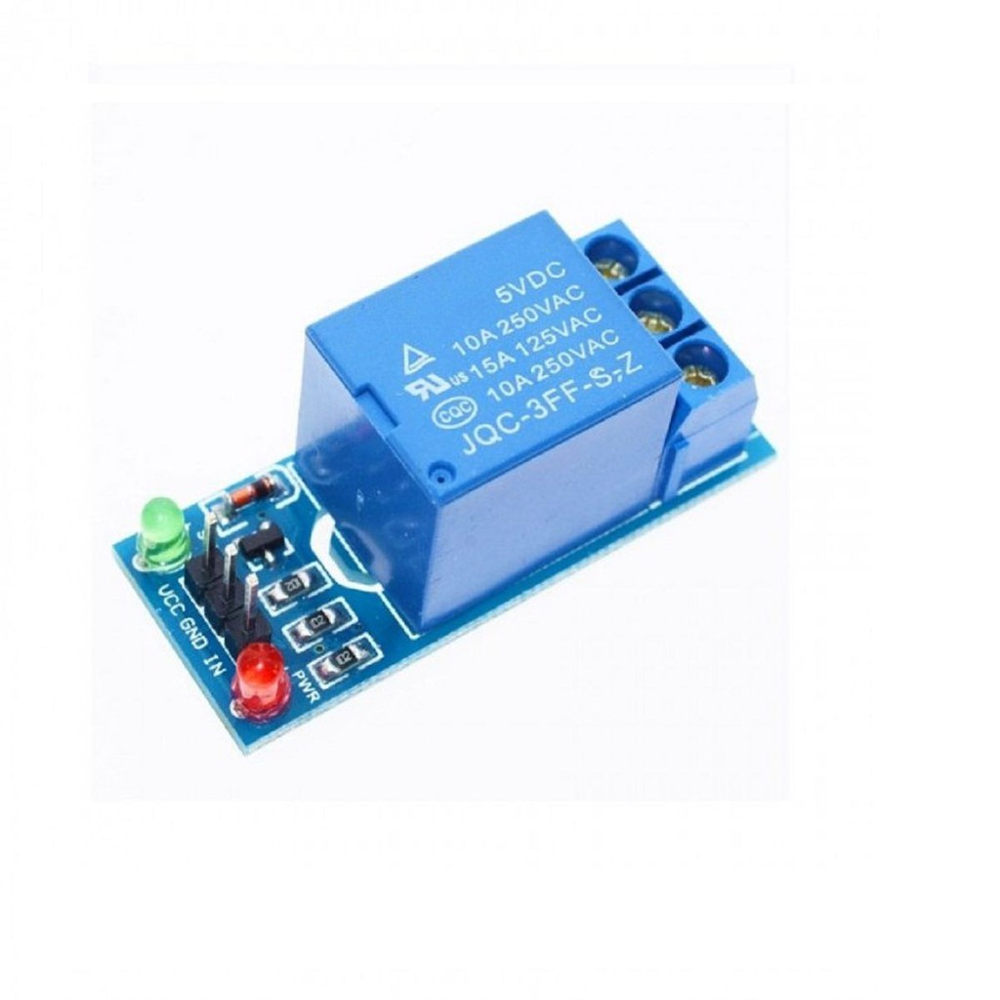
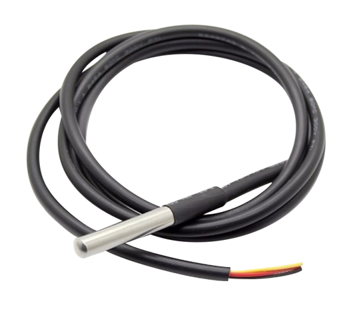

# Projeto - Aquecedor de água com controle ON-OFF

Esta proposta de projeto consiste em um simples sistema de controle de temperatura do tipo ON-OFF, que pode ser implementado utilizando qualquer microcontrolador. O objetivo deste sistema de controle é aquecer um liquido, como água, mantendo sua temperatura próxima a um valor pré-determinado (um _set-point_).&#x20;

Os materiais necessários para este projeto são os seguintes:

* Uma placa de desenvolvimento baseada em um microcontrolador ou um SoC (Ex: Arduino Uno, Raspberry Pi, STM32 Blue Pill, ESP32 DevKit, etc);
* Um ebulidor portátil;
* Um módulo de relé;
* Um sensor de temperatura DS18B20.

Nas próximas seções deste artigo, as partes do projeto, bem como a programação do controlador, serão explicadas.

### Ebulidor

<figure><figcaption><p>Exemplo de ebulidor</p></figcaption></figure>

Um ebulidor é um aquecedor de água portátil. Normalmente é um equipamento simples, robusto e de fácil uso - basta colocá-lo em um copo d'água e ligá-lo na tomada. Como o próprio nome diz, o aquecimento proveniente do ebulidor é suficiente para fazer a água entrar em ebulição em alguns minutos ou segundos após o equipamento ser ligado.

Para ligar ou desligar o ebulidor automaticamente com comandos elétricos de baixa tensão, é necessário utilizar um relé. Um relé é um dispositivo eletromecânico que consiste em um interruptor controlado por uma bobina. Quando a bobina é energizada, o campo magnético produzido por esta faz com que o interruptor mude de posição. O interruptor deste relé deve ser conectado ao cabo de alimentação do ebulidor, ligação esta que pode ser feita de duas formas: cortando o cabo (o que presume que o equipamento precisará ser danificado para que o projeto possa ser executado), ou utilizando uma extensão com relé (o que elimina a necessidade de danificar o ebulidor, mas aumenta o custo do projeto).

Relés são componentes baratos, fáceis de usar e também fáceis de achar. No entanto, não é correto conectar os terminais de uma bobina diretamente às saídas digitais de um microcontrolador, pois estas saídas são de baixa potência e podem ser danificadas pelas altas correntes e também por eventuais variações de tensão produzidas pela bobina. Ao invés disso, o ideal é utilizar um circuito eletrônico de intermédio entre a bobina do relé e a saída digital do microcontrolador. Existem diversos módulos de relé no mercado que já vêm com este circuito eletrônico de intermédio.

<figure><figcaption><p>Exemplo de módulo de relé para microcontroladores</p></figcaption></figure>

### Sensor de temperatura DS18B20

O DS18B20 é um sensor digital de temperatura que pode ser submerso em água e que suporta temperaturas de -55ºC a 125ºC. Este sensor possui três terminais: um GND, um VCC (3V a 5.5V) e um terminal de dados com comunicação do tipo _One Wire_. Com o SDK Arduino Core, é possível ler facilmente os dados deste sensor através das bibliotecas _OneWire_ e _DallasTemperature_.

<figure><figcaption><p>Foto do sensor DS18B20</p></figcaption></figure>

### Programação

Neste projeto, utiliza-se a técnica de controle _ON-OFF_ para manter a temperatura da água próxima a uma temperatura pré-definida entre a temperatura ambiente e o ponto de ebulição da água. A técnica _ON-OFF_, neste caso, é uma abordagem de fácil implementação que consiste em ligar e desligar o ebulidor periodicamente para manter a temperatura da água dentro de um intervalo aceitável em torno da temperatura desejada_._

Antes de partir para a explicação sobre a programação do controle _ON-OFF_, é necessário abordar o significado de algumas palavras-chave de controle:

* **Controlador** - é o "cérebro" do sistema de controle, responsável por fazer a leitura dos sensores e controlar os atuadores.
* **Variável controlada** - é uma grandeza física que precisa ser mantida em torno de um valor desejado. No caso deste projeto, a variável controlada é a temperatura da água.
* _**Set-point**_ - é um valor no qual deseja-se manter a variável controlada.
* **Variável manipulada** - é o parâmetro manipulado pelo controlador para manter a variável controlada próxima ao _set-point_. Neste projeto, a variável manipulada é o estado do ebulidor (_**ON**_ ou _**OFF**_).

Em controle _ON-OFF_ existe também a **histerese**, que é uma tolerância de oscilação da variável controlada em torno do _set-point_.

O fluxograma a seguir mostra a lógica do programa que deve ser implementado.

<figure><figcaption><p>Fluxograma do programa</p></figcaption></figure>

O pseudocódigo a seguir mostra esta mesma lógica de programa utilizando uma estrutura similar à do Arduino Core.

```cpp
void init()
{
    if( get_water_temperature() < get_setpoint() )
    {
        set_heater_state(ON);
    }
    else
    {
        set_heater_state(OFF);
    }
}

void loop()
{
    float wt = get_water_temperature();
    float sp = get_setpoint();
    float h = get_hysteresis();
    
    if( get_heater_state() == ON && wt >= sp + h/2 )
    {
        set_heater_state(OFF);
    }
    
    if( get_heater_state() == OFF && wt <= sp - h/2 )
    {
        set_heater_state(ON);
    }
}
```

De forma abstrata, a lógica apresentada acima pode ser descrita da seguinte maneira: quando o controlador é ligado, verifica-se se a temperatura da água é menor do que o _set-point_. Se sim, o ebulidor é ligado, e se não, o ebulidor permanece desligado. Após esta primeira etapa, o programa entra em um _loop_ infinito, executando os seguintes comandos periodicamente:

* &#x20;Se o sistema está em modo de aquecimento (ebulidor ligado) e o limite máximo de temperatura permitido pelo sistema, definido como $$T_{sp}+\frac{H}{2}$$, foi atingido, o sistema entra em modo de resfriamento (ebulidor desligado).
* Se o sistema está em modo de resfriamento (ebulidor desligado) e o limite mínimo de temperatura permitido pelo sistema, definido como $$T_{sp}-\frac{H}{2}$$, foi atingido, o sistema entra em modo de aquecimento (ebulidor ligado).

É extremamente recomendável que se adicione algum tipo de display ao projeto para que seja possível monitorar a temperatura da água em tempo real. Isto facilita o diagnóstico de eventuais falhas e erros de programação.

## Leitura adicional recomendada

*   THOMSEN, A. **Temperatura debaixo d’água com sensor de temperatura DS18B20**. Disponível em: <[https://www.filipeflop.com/blog/sensor-de-temperatura-ds18b20-arduino](https://www.filipeflop.com/blog/sensor-de-temperatura-ds18b20-arduino)/>.

    ‌
