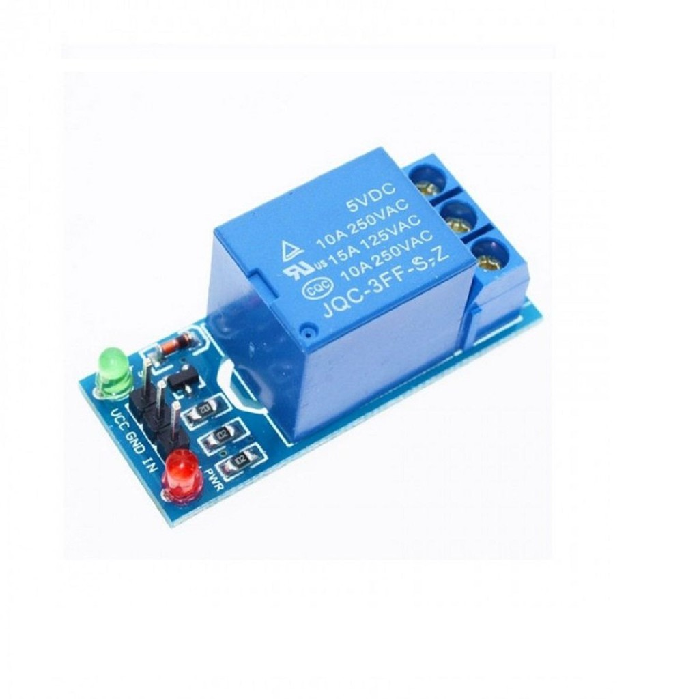

# Projeto - Controlador de temperatura on-off

Esta proposta de projeto consiste em um simples controlador de temperatura do tipo on-off, que pode ser implementado utilizando qualquer microcontrolador. O objetivo deste sistema de controle é aquecer um liquido (como água) mantendo sua temperatura próxima a um valor pré-determinado (um _set-point_).&#x20;

Os blocos funcionais do projeto são os seguintes:

* Um controlador, que pode ser um microcontrolador, um _system-on-chip_ (SoC) ou um _single-board-computer_ (SBC). Para prototipação, é recomendável utilizar uma placa de desenvolvimento como Arduino, Raspberry Pi, Blue Pill, etc.
* Um atuador de temperatura que aqueça o liquido e que possa ser ligado e desligado por comandos elétricos. Um ebulidor e um relé podem ser utilizados.
* Um sensor de temperatura a prova d'agua, como o DS18B20.

Nas próximas seções deste artigo, as partes do projeto, bem como a programação do controlador, serão explicadas.

### Ebulidor

<figure><figcaption>
Exemplo de ebulidor
</figcaption></figure>

Um ebulidor é um aquecedor de água portátil. Normalmente é um equipamento simples, robusto e de fácil uso - basta colocá-lo em um copo d'água e ligá-lo na tomada. Como o próprio nome diz, o aquecimento proveniente do ebulidor é suficiente para fazer a água entrar em ebulição em alguns minutos ou segundos após o equipamento ser ligado.

Para ligar ou desligar o ebulidor automaticamente com comandos elétricos de baixa tensão, é necessário utilizar um relé. Um relé é um dispositivo eletromecânico que consiste em um interruptor controlado por uma bobina. Quando a bobina é energizada, o campo magnético produzido por esta faz com que o interruptor mude de posição. O interruptor deste relé deve ser conectado ao cabo de alimentação do ebulidor, ligação esta que pode ser feita de duas formas diferentes: cortando o cabo (o que presume que o equipamento precisará ser danificado para que o projeto possa ser executado), ou utilizando uma extensão com relé (o que elimina a necessidade de danificar o ebulidor, mas aumenta o custo do projeto).

Relés são componentes baratos, fáceis de usar e também fáceis de achar. No entanto, não é correto conectar os terminais de uma bobina diretamente às saídas digitais de um microcontrolador, pois estas saídas são de baixa potência e podem ser danificadas pelas altas correntes e também por eventuais variações de tensão produzidas pela bobina. Ao invés disso, o ideal é utilizar um circuito eletrônico de intermédio entre a bobina do relé e a saída digital do microcontrolador. Existem diversos módulos de relé no mercado que já vêm com este circuito eletrônico de intermédio.

<figure><figcaption>
Exemplo de módulo de relé para microcontroladores
</figcaption></figure>

### Sensor de temperatura

para escrever...

### Programação

para escrever...

